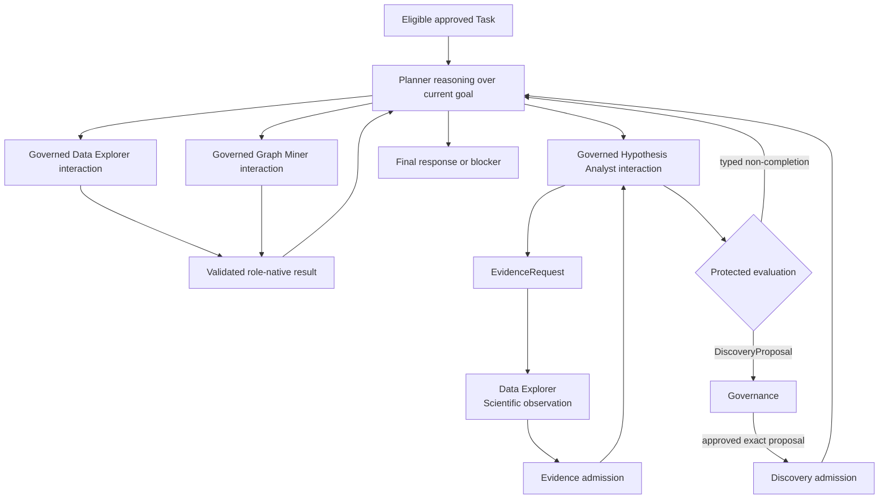

# End-to-end flow

This page owns the target cross-component operational sequence. It brings the
authority, Planner, specialist, dispatch, and admission boundaries together
without forcing every Task through a Hypothesis-to-Discovery lifecycle.

The sequence is target architecture. Current main does not yet implement the
complete flow. [MVP-v2](mvp-runtime-subset.md) requires one minimum complete
scientific loop through this sequence, including restart and grounded
follow-up; it does not supersede the broader canonical architecture.

## The authority sequence

```text
proposal
!= approval
!= execution
!= observation
!= Evidence admission
!= protected evaluation
!= governance
!= Discovery admission
```

A path may end safely after any act with a typed result, blocker, rejection, or
non-completion. Completion does not imply a Discovery.

## Objective bootstrap

1. The human states or resumes research intent through the Planner.
2. The Planner binds the interaction to an existing Objective or proposes a
   new Objective within the Workspace boundary.
3. Application authority validates identity, scope, lifecycle, and any required
   approval before admitting or resuming Objective state.
4. Application authority resolves every retained SessionFrame member into
   Planner context and may add authorized supplemental context without
   subtracting retained membership.
5. If identity, scope, or active-session ownership is ambiguous, bootstrap
   stops with a typed blocker.

The Objective establishes scope; it is not empirical support.

## Planning consultations

The Planner may request bounded consultation before drafting a plan:

- Data Explorer may inspect admitted datasets and return availability,
  diagnostics, limitations, or AnalysisFrame material;
- Graph Miner may return eligible object references, paths, gaps,
  contradictions, validity information, or dependencies.

Application coordination validates and normalizes each consultation result.
The Planner uses it only in planning context. Consultation is not a durable
Task unless an independently governed deliverable is required, and an
observation is not automatically Evidence.

## Plan proposal, approval, and activation

1. The Planner constructs transient canonical Objective, Task, and Plan
   objects, with direct canonical Task-ID membership and explicit dependency
   edges. The Plan contains no ordering, priority, capability, provider,
   specialist, tool, exact DataProfile identity, or configurable stopping-
   condition or replan-trigger policy.
2. Domain construction enforces structural validity without making the pending
   objects authoritative or durable.
3. The Planner presents those exact pending canonical objects to the Human.
4. Human approval authorizes only those exact objects.
5. Application authority performs commit-boundary validation and atomically
   persists, adopts, and activates the exact approved objects.

There is no mandatory separate application preflight or admission stage before
Human review.

A rejection, hold, or requested revision returns to the Planner without
creating authoritative Plan state. Any separately retained draft or
interaction provenance is not the approved Plan.

Plan completion, interruption, and replanning are workflow-lifecycle concerns.
An actual cause that later requires reconsideration is recorded by that
workflow against the affected immutable Plan; it is not hypothetical
Planner-authored trigger policy inside the Plan. Scientific stopping
remains `InvestigationProtocol`-owned, and bounded execution stopping remains
owned by the applicable role-native work order such as `DataWorkOrder`.

## Governed execution overview



Application authority determines Task eligibility and which governed
specialist tools are available. The Planner receives the eligible Task as a
goal and reasons over zero, one, or multiple allowed specialist interactions;
Task kind may constrain authority but is not a compile-time route. Execution
internals may retain capability-based provider resolution behind a role-level
tool boundary, but capability and provider selection are not Plan
content. Planner response synthesis is not a Task kind, capability, provider,
or dispatch path.

The dependency DAG determines structural eligibility. Independent Tasks are
intentionally unordered; execution order among eligible Tasks is a later
Planner reasoning concern. Planner describes intended data scope in
the Task instruction but does not bind an exact DataProfile. The responsible
specialist or controller receives complete authoritative DataProfile context,
selects the applicable profile and concrete scope, and leaves the exact profile
used to downstream execution or scientific provenance.

## DATA path

1. Application coordination constructs a `DataWorkOrder` for an approved
   `DATA` Task.
2. The dispatcher resolves the Data Explorer capability.
3. Data Explorer performs only the admitted dataset operations.
4. It returns `DataExplorerResult` with observations, AnalysisFrame material,
   diagnostics, artifacts, limitations, blockers, and status.
5. Application coordination validates and normalizes the result into a
   `PlannerWorkOutcome`.
6. Application authority admits only the permitted provenance, workflow, or
   artifact transitions.
7. The Planner presents the result, proposes follow-up work, or replans.

This path does not require a Hypothesis and does not automatically create
Evidence or Discovery.

## SCIENTIFIC path

1. An eligible feasible leaf `SCIENTIFIC` Task is routed to Hypothesis Analyst.
2. Hypothesis Analyst determines feasibility and may author at most one
   Hypothesis for that Task.
3. It authors the InvestigationPlan, InvestigationProtocol, Evidence
   obligations, and initial EvidenceRequests.
4. Application authority validates and admits the scientific-investigation
   records under their exact authority and lineage.
5. Each EvidenceRequest is dispatched to Data Explorer. Hypothesis Analyst has
   no dataset access.
6. Data Explorer returns bounded observation material and provenance.
7. Application authority validates the observation and admits Evidence only if
   every scientific, provenance, scope, attempt, and fencing obligation passes.
8. Hypothesis Analyst may request further Evidence, revise the protocol under
   the applicable approval rules, or perform protected final evaluation over
   the closed eligible bundle.
9. Evaluation returns a DiscoveryProposal or typed non-completion.

Typed non-completion is a valid ending. It is normalized and presented without
manufacturing a Discovery.

## GRAPH path

1. Application coordination constructs a bounded `GraphInquiryRequest` for an
   approved `GRAPH` Task.
2. The dispatcher resolves Graph Miner.
3. Graph Miner queries only eligible read-only research state.
4. `GraphInquiryResult` returns references, paths, gaps, contradictions,
   validity or dependency information, related Objective suggestions,
   limitations, and blockers.
5. Application coordination normalizes the result for the Planner.
6. The Planner may present a GeneratedView, propose follow-up work, or replan.

Graph Miner cannot mutate the graph or admit a cross-Objective relation. The
path does not require a Hypothesis and cannot create Evidence or Discovery.

## Planner response synthesis

1. The Planner requests a purpose-specific, validity-aware projection of
   admitted state and normalized outcomes.
2. Application authority excludes ineligible, stale, wrong-scope, or
   wrong-epistemic-role material.
3. The Planner coordinates a `GeneratedView` with source references,
   limitations, blockers, and validity warnings.
4. Application authority may persist presentation metadata, but the view
   remains derived and non-authoritative.
5. The Planner presents the view to the human.

Planner response synthesis does not create a Task, force inputs into a
scientific investigation, or turn a summary into a Discovery.

## Capability blocked or unavailable

When an approved Task requires an unavailable capability:

1. dispatch stops before specialist execution;
2. a typed unavailable or blocked outcome identifies the Task, work identity,
   missing capability, limitations, and permitted next actions;
3. the approved Task and plan retain their meaning;
4. the Planner may hold, request a capability change through a successor plan,
   or replan the work.

No legacy executor, semantic guess, or Task reinterpretation is permitted.

## Holds, correction, and additional Evidence

Governance or approval may produce several non-terminal branches:

- **hold** preserves exact pending identity and stops downstream transition;
- **correction request** returns the content to its owning authority;
- **additional Evidence request** returns the scientific investigation to
  EvidenceRequest construction and bounded observation;
- **conflict review** gathers eligible contradiction and validity information
  without rewriting scientific content;
- **replanning** creates a successor Plan or restarts grounded planning.

Governance never edits a Hypothesis, protocol, evaluation, or
DiscoveryProposal. Hypothesis Analyst or the appropriate scientific authority
must author the revised proposal.

## Discovery governance and admission

1. Protected evaluation produces an exact `DiscoveryProposal` bound to the
   Hypothesis, admitted Evidence, scope, validity basis, and outcome.
2. Governance approves, rejects, holds, or requests correction, additional
   Evidence, or conflict review.
3. An approval is bound to that exact proposal version and does not make it
   durable scientific state.
4. Application authority validates authorization, cardinality, lineage,
   Evidence eligibility, scope, allowed outcome, and validity basis.
5. Only a successful atomic admission creates the Discovery and related
   lifecycle or validity records.

Rejected, held, superseded, or invalid proposals remain traceable non-FCO state
and do not appear as Discoveries.

## Validity-aware presentation and continuity

Every Planner-facing outcome is normalized with authoritative references,
limitations, blockers, permitted next actions, and a result digest. Before the
Planner presents a prior result, application authority determines current-use
eligibility for that purpose and scope.

GeneratedViews distinguish historical truth-to-record from present validity.
On restart, the system reconstructs the active Plan, Task state,
pending approvals, attempts, admitted Evidence and Discoveries, blockers,
SessionFrame, and validity warnings from durable state. It does not rely on an
agent's retained transcript or hidden memory.

## Implementation status

**Unsupported** end to end. The Planner cognitive core can answer, request
clarification, or produce a transient validated Plan and Task bundle through
one PydanticAI invocation per graph turn. The in-process LangGraph lifecycle
retains, replaces, or discards an exact candidate across natural-language Human
review and calls the application service only after typed authorization. That
service atomically admits and activates the exact bundle on SQLite. The graph
performs no Plan execution.
Generic capability dispatch foundations and several durable execution-safety
transitions exist separately.

The S0 infrastructure boundary is **Implemented**: bootstrap composes an
explicit registry, dispatcher, Data Explorer provider factory, and Planner
dependency. Capability dispatch is not model-visible Planner cognition, and
Phase 2 exposes no Planner tool. These separate foundations do not establish
the end-to-end research-state flow.

Durable review recovery, Plan execution, role-native contracts, full specialist
implementations, EvidenceRequest-to-Evidence admission, protected evaluation,
governance, Discovery admission, full PlannerWorkOutcome consumption, and
validity-aware presentation sequence remain incomplete or absent. Data
Explorer's current local donor paths are not the canonical DATA workflow;
SCIENTIFIC and GRAPH providers are not registered as runnable.

Use [MVP-v2](mvp-runtime-subset.md) for the minimum complete-loop definition,
[System overview](system-overview.md) for the component map,
and [Authority boundaries](authority-boundaries.md) for the controlling
authority rules.
