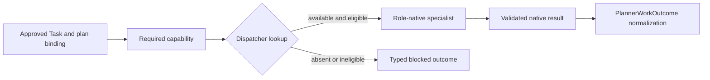

# Executor and dispatch

CogniEDA specialists perform bounded work behind typed, capability-based
contracts. They are restart-safe workers, not alternate human-facing agents and
not owners of durable research state.

This page defines the target specialist and dispatch architecture. It avoids
freezing exact serialization schemas; the named contracts define semantic and
authority boundaries.

## Common executor boundary

Every specialist invocation has the same operational posture:

1. application coordination receives an admitted work identity;
2. the dispatcher resolves the required capability against an explicit
   registry;
3. the specialist receives only its role-native typed input and eligible
   context;
4. the specialist returns a bounded role-native result;
5. application coordination validates and normalizes the result;
6. application authority decides which durable admission or transition, if
   any, is permitted.

Executors should be stateless or restart-safe. Durable progress, leases,
attempt identity, and replay protection belong to application authority, not
to hidden in-memory agent state.

## Task semantics and capability

Canonical Task kinds are:

```text
DATA
SCIENTIFIC
GRAPH
SYNTHESIS
```

The required capability belongs to Task semantics. Executor assignment belongs
to `PlanTaskBinding` or equivalent plan-version state, not to Task identity.
Changing the assigned worker therefore does not change the Task's meaning.

Dispatch is capability-based and fail closed. For an approved Task whose
required capability is unavailable, the dispatcher must decline execution,
preserve the Task meaning and approved plan, return a typed unavailable or
blocked outcome, and expose permitted next actions to the Planner.

It must not fall back to a legacy executor, route by semantic guess, silently
change capability, or reinterpret the Task.

## Role-native contracts

The canonical specialist contracts are:

```text
DataWorkOrder
  -> DataExplorerResult

ScientificInvestigationInput
  -> HypothesisAnalystResult

GraphInquiryRequest
  -> GraphInquiryResult
```

These are different contracts because the roles have different inputs,
allowed actions, outputs, and authority. A universal optional-field envelope
would create hidden authority channels and is not canonical.

### DataWorkOrder to DataExplorerResult

A `DataWorkOrder` describes a bounded direct `DATA` Task: admitted dataset
references, allowed operation, scope, resource limits, required diagnostics or
artifacts, and stopping conditions. `DataExplorerResult` returns observations,
`AnalysisFrame` material, diagnostics, artifacts, limitations, blockers, and
bounded completion status.

This direct path is not a scientific `EvidenceRequest`. It may produce useful
observations and views without creating Evidence or a Discovery.

### ScientificInvestigationInput to HypothesisAnalystResult

`ScientificInvestigationInput` binds an eligible feasible leaf `SCIENTIFIC`
Task to the scientific-investigation state available to Hypothesis Analyst.
The result may contain feasibility, Hypothesis and protocol proposals,
EvidenceRequests, protocol revisions, a protected evaluation,
`DiscoveryProposal`, or a typed non-completion.

Hypothesis Analyst never receives dataset access. An EvidenceRequest is sent by
application coordination to Data Explorer, and the resulting observation must
pass Evidence admission before it can enter protected evaluation.

### GraphInquiryRequest to GraphInquiryResult

A `GraphInquiryRequest` bounds a read-only research-state question by Objective,
eligible object types, scope, validity posture, and traversal limits.
`GraphInquiryResult` may contain object references, graph paths,
contradictions, gaps, validity information, dependencies, related Objective
suggestions, limitations, and blockers.

The result cannot mutate the graph, admit a cross-Objective relation, or create
Evidence or Discovery.

## Data Explorer

Data Explorer has exclusive dataset access. It operates in two conceptual
modes:

| Mode | Initiator and purpose | Scientific consequence |
| --- | --- | --- |
| Direct `DataTask` | an approved `DATA` Task requests bounded data work | produces observations, diagnostics, AnalysisFrame material, artifacts, or a typed ending; not automatically Evidence |
| Scientific `EvidenceRequest` | Hypothesis Analyst requests an observation required by an InvestigationProtocol | produces bounded observation material that may become Evidence only after application-authority admission |

The modes must not be equated. Data Explorer does not define or evaluate the
Hypothesis, create a Discovery, govern a proposal, admit Evidence, write to
persistence, or communicate with the human.

## Hypothesis Analyst

Hypothesis Analyst controls scientific feasibility and investigation. For an
eligible feasible leaf `SCIENTIFIC` Task it owns at most one Hypothesis, the
InvestigationPlan, InvestigationProtocol, Evidence obligations, repeated
EvidenceRequest construction, governed protocol revision, and protected final
evaluation. It returns a `DiscoveryProposal` or typed non-completion.

It has no dataset access, cannot bypass Data Explorer, cannot persist
authoritatively, cannot self-govern, and does not communicate with the human.
No separate peer Evaluator agent is introduced.

## Graph Miner

Graph Miner performs read-only inquiry over eligible research state. It may
support a planning consultation or an approved leaf `GRAPH` Task. It cannot
mutate graph state, perform dataset operations, create Evidence or Discovery,
govern proposals, admit cross-Objective relations, or communicate with the
human.

## Capability registry and dispatcher

The capability registry records stable capability identity, compatible
role-native contract, version and policy eligibility, availability and health,
and constraints needed for deterministic selection.

The dispatcher accepts an admitted work identity and required capability. It
does not infer scientific intent from prose. It verifies plan binding,
capability availability, contract compatibility, attempt identity, and policy
before invoking a worker.



Unknown capability, missing registration, incompatible contract, ambiguous
binding, or stale attempt identity all fail closed.

## PlannerWorkOutcome normalization

The Planner does not consume arbitrary specialist-native output directly.
Application coordination validates the native result and normalizes the
Planner-facing subset into `PlannerWorkOutcome`.

Conceptual fields include source role, Task identifier, work identifier,
status, semantic summary, authoritative references, limitations, blockers,
permitted next actions, and result digest.

Normalization is projection, not authorship. It preserves authoritative
references and limitations while excluding specialist-private or
context-ineligible material. The target deliberately does not freeze field names,
wire format, or serialization details.

## Implementation status

**Partially implemented.** At the S0 library boundary, one lightweight
`Capability` `StrEnum` drives an explicit `Capability -> ProviderFactory`
registry. One dependency-aware factory may serve multiple capabilities and its
provider instance is reused. Duplicate and absent registrations fail closed.
The thin async dispatcher invokes the resolved provider and preserves provider
failure as a controlled error.

The current PydanticAI adapter exposes a typed data-capability request through
Planner dependencies. Focused tests validate adapter to dispatcher to
registered-provider invocation without a model endpoint. Bootstrap explicitly
composes a registry, Data Explorer provider factory, dispatcher, and
`PlannerDeps`; availability no longer depends on executor module import order.

`ExecutionResult` now contains only shared transport metadata.
`DataExplorerResult` and the deferred `HypothesisAnalystResult` own their
role-native fields. A minimal `PlannerWorkOutcome` projection seam consumes
only shared metadata; full Planner consumption remains **Deferred**.

At the bounded M3-A direct-DATA surface, Planner selects `DATA_ANALYSIS` and
creates the Task without choosing a Data Explorer operation. Data Explorer owns
the typed `Task.instruction -> DataAnalysisPlan` translation through its
`DataAnalysisPlannerPort`, using the application-supplied authoritative
DataProfile projection from `DataExplorerInput` and the finite
supported-operation set. Deterministic code
then validates exact columns and bounded parameters before execution. The
role-specific `DataAnalysisPlan`, `DataAnalysisOperation`, and
`CorrelationMethod` contracts live under `agents.data_explorer`; the generic
`execution` package does not define or import them.

Data Explorer is registered for `DATA_ANALYSIS`, `DATA_PROFILING`, and
`DATA_TRANSFORMATION`. The first two have a bounded donor implementation when
given the active M1-A Task instruction, authoritative DataProfile projection,
and a local dataset path. Profiling
returns the typed M1-A DataProfile through a Data Explorer-owned tool boundary
and pure deterministic computation. It does not drop duplicate rows, all-null
rows, or missing values and does not mutate the active frame. Transformation
returns a typed blocked result until it can create a successor dataset and
DataProfile; it never establishes in-place mutation as valid behavior.

Canonical `DataWorkOrder`, `ScientificInvestigationInput`,
`GraphInquiryRequest`, and complete role-native admission contracts remain
**Unsupported**. Hypothesis Analyst and Graph Miner remain unregistered runtime
scaffolds. Full Planner-to-real-dataset-to-Evidence-to-Planner execution is
also **Unsupported**.

See [MVP runtime subset](mvp-runtime-subset.md) for the deliberately smaller
executable slice and [Persistence and admission](persistence-and-admission.md)
for the canonical durable boundary around attempts and results.
