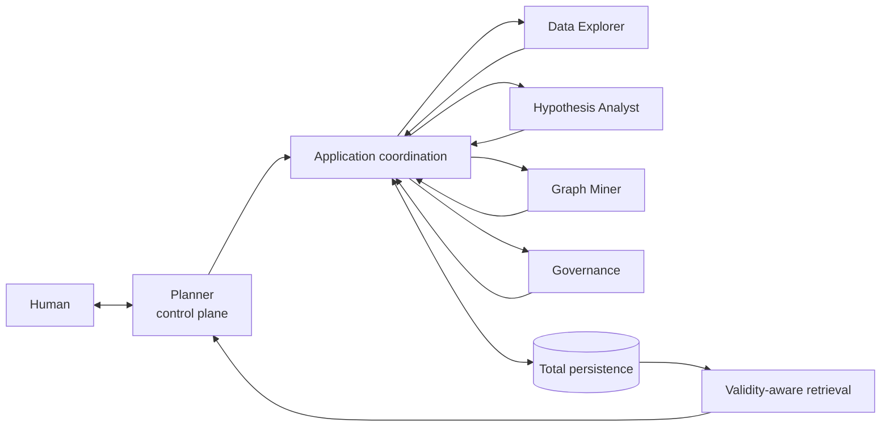

# System overview

CogniEDA is **validity-preserving research-state infrastructure**. Its
architecture preserves the meaning, lineage, and current-use eligibility of
analytical work across actions, specialists, people, and sessions.

This page defines target system boundaries. It does not claim that every
component or flow is implemented today. Current implementation status is
summarized near the end of the page and belongs in detail to the later status
track.

## Architectural priorities

Every architectural choice follows this order:

1. conclusion validity and traceability;
2. context type safety;
3. multi-session continuity;
4. speed and convenience, only after the first three are protected.

CogniEDA is therefore not a chatbot, an autonomous scientist, a generic
multi-agent framework, a vector-memory wrapper, or an unrestricted analysis
agent. Conversation, models, retrieval, and tools may participate, but none of
them becomes authoritative merely by producing useful output.

## Major system boundaries

The target architecture has three cooperating planes:

| Plane | Components | Architectural purpose |
| --- | --- | --- |
| control plane | Human and Planner | establish intent, coordinate plans, obtain approval, route work, replan, and present high-level results |
| specialist plane | Data Explorer, Hypothesis Analyst, and Graph Miner | perform bounded role-specific work without acquiring governance or persistence authority |
| authority plane | application authority and governance | validate contracts, authorize eligible proposals, admit durable state, apply lifecycle and validity transitions, and preserve restart safety |



The human-facing boundary is exactly:

```text
Human <-> Planner
```

Executors never communicate directly with the human. Application coordination
mediates dispatch, result normalization, durable transitions, and recovery; it
does not become the scientific author of the content it persists.

## Research state and execution

The [research-state foundation](../concepts/research-state/index.md) separates
research intent, planning state, data state, scientific commitments,
observations, claims, active context, provenance, and operational recovery.
Execution moves bounded work between those layers; it does not collapse them.

A `Task` says what governed work exists. A plan version says how that work is
coordinated. An execution attempt says what was run. An observation says what
the bounded operation returned. `Evidence` says which observation was admitted
under the applicable scientific and provenance obligations. A `Discovery`
says which governed claim was ultimately admitted. These are different state
transitions with different authorities.

The high-level authority sequence is:

```text
proposal
  -> approval
  -> execution
  -> observation
  -> Evidence admission
  -> protected evaluation
  -> governance
  -> Discovery admission
```

Each arrow is conditional, and the terms are not interchangeable. Many valid
flows stop, branch, request more work, or end with a typed non-completion before
the final step.

## Semantic graph and total persistence

The semantic Knowledge Graph is not the complete persistence model. It contains
exactly:

```text
Objective
Hypothesis
Evidence
Discovery
```

Other durable state remains outside that graph. This includes `DataProfile`,
`Assumption`, `Task`, `SessionFrame`, planning and protocol records,
`AnalysisFrame`, `ExecutionRun`, governance records, validity events, outbox and
inbox records, leases, replay records, and caches. FCO status, semantic-graph
membership, durability, immutability, and authority are independent
properties. The [object catalog](../reference/object-catalog.md) owns their
classification.

Total persistence spans several conceptual state families:

- semantic research state;
- data and workflow state;
- planning and scientific-investigation state;
- provenance and execution state;
- governance, admission, and validity state;
- active context and presentation metadata;
- operational recovery and cache state;
- filesystem and dataset artifacts.

This is an implementation-neutral separation. It neither requires nor forbids
a particular database technology.

## Generated views are presentation

A `GeneratedView` is a derived answer, report, table, visualization, or
synthesis. The Planner may coordinate its production, but the view is not an
FCO, not Evidence, not a Discovery, and not an authority record. It must retain
references to the eligible state from which it was generated and be refreshed
or withheld when those sources lose current-use eligibility.

A `SessionFrame` is different: it is the governed active-context FCO for a
particular purpose and scope. It selects eligible state; it does not turn that
state into a new scientific claim.

## Target component map

| Component | Owns | Does not own |
| --- | --- | --- |
| Human | research intent, consequential approval, policy choice, and governance participation where required | specialist execution or durable admission |
| Planner | coordination, plan proposals, routing, approval interaction, replanning, active-context and presentation coordination | scientific operationalization, Evidence authorship, or protected evaluation |
| Data Explorer | exclusive bounded dataset access and observation production | Hypothesis definition, evaluation, Discovery, governance, or persistence |
| Hypothesis Analyst | scientific feasibility, operationalization, Evidence obligations, protocol revision, and protected final evaluation | dataset access, governance self-approval, or persistence |
| Graph Miner | read-only research-state inquiry | mutation, dataset operations, Evidence, Discovery, or governance |
| governance | authorization of exact eligible proposals and requests for review or additional work | rewriting scientific content or durable admission |
| application authority | identity, validation, admission, persistence, transactions, lifecycle and validity transitions, and operational safety | planning meaning or scientific authorship |

The detailed contracts belong to [Authority boundaries](authority-boundaries.md),
[Planner architecture](planner-architecture.md),
[Executor and dispatch](executor-and-dispatch.md), and
[Persistence and admission](persistence-and-admission.md).

## Implementation status

**Partially implemented.** Current main includes typed research-state schemas
and persistence surfaces; Planner operation drafting, durable approval records,
and an atomic commit boundary for a bounded set of operations; a capability
registry and dispatcher seam; and database-backed execution-attempt, outbox,
lease, fencing, retry, and idempotency foundations.

The complete target architecture is not yet a supported end-to-end runtime.
Canonical plan-version records, canonical Task kinds, role-native specialist
contracts, runnable default specialist graphs, complete scientific
investigation and governance flows, normalized `PlannerWorkOutcome` handling,
and full Evidence and Discovery admission remain incomplete or absent. These
limitations prevent the target flow from being described as currently
operational.

Continue with [Authority boundaries](authority-boundaries.md), or use
[End-to-end flow](end-to-end-flow.md) for the operational sequence.
