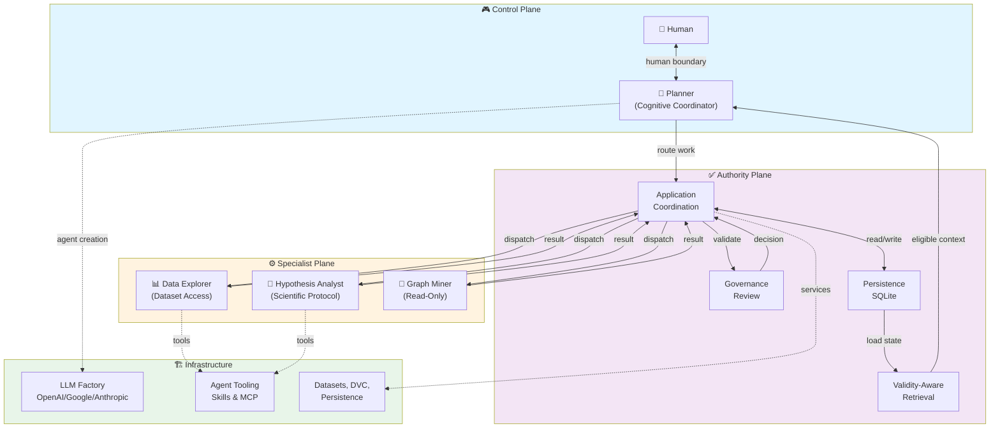
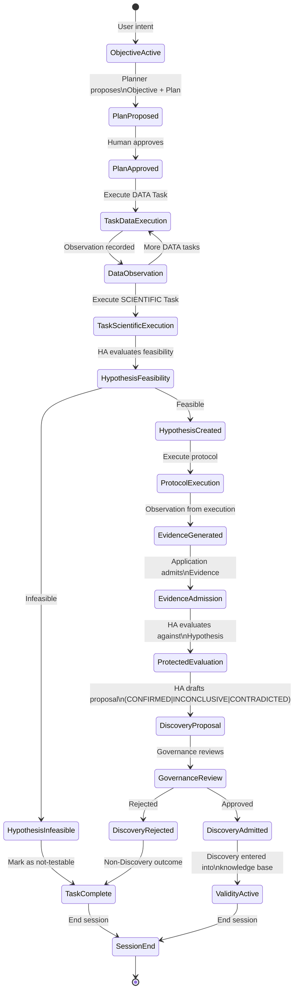
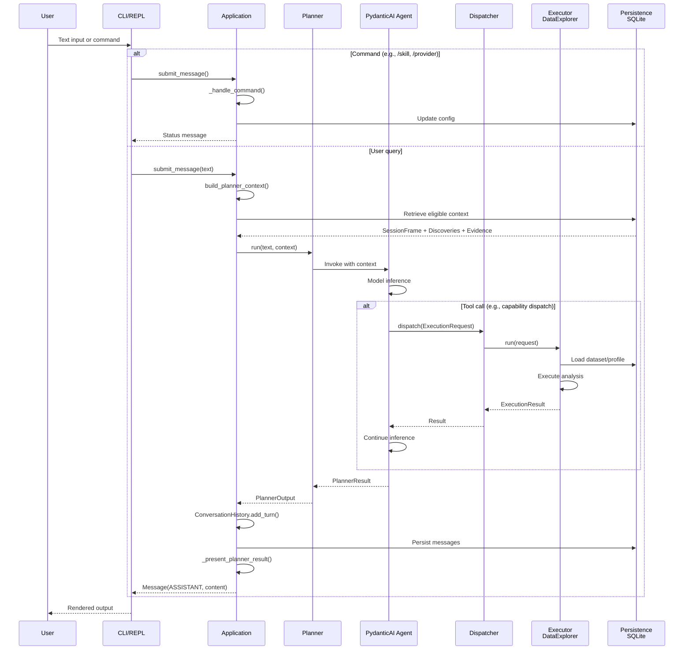
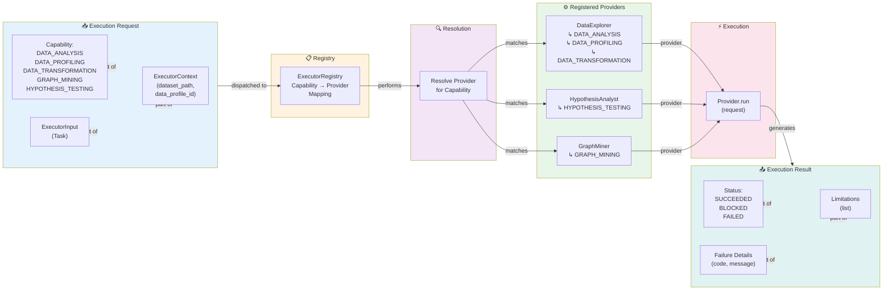
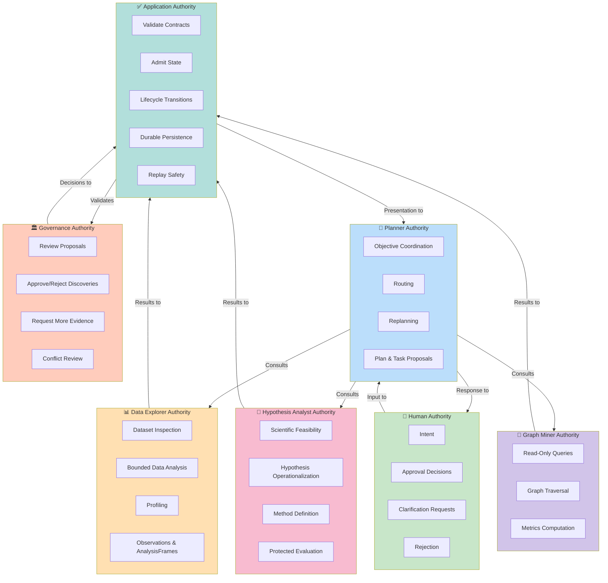
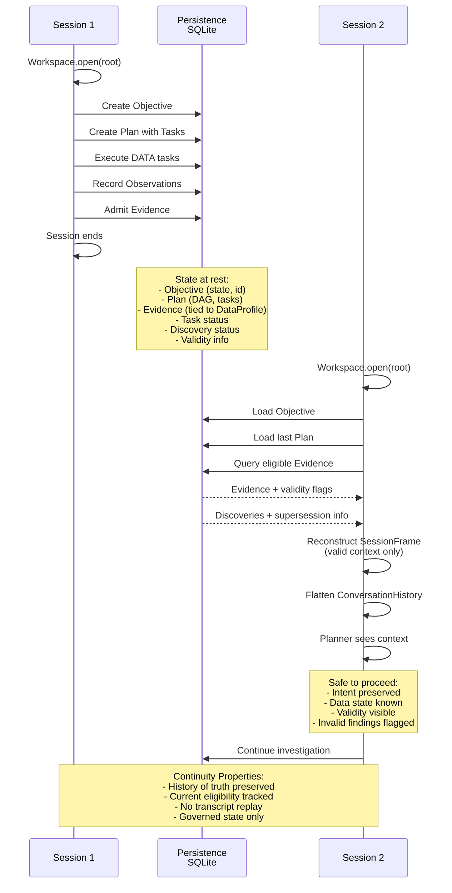
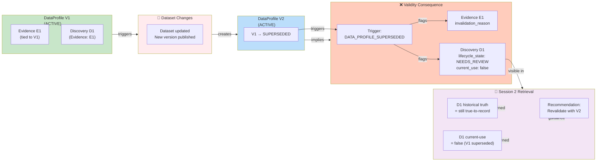

# CogniEDA Architecture Diagram

## System Overview

## Research State Lifecycle

## Message Processing Flow

## Data & State Layering

```mermaid
graph TB
    subgraph Intent["🎯 Research Intent Layer"]
        OBJ["Objective<br/>(what are we investigating?)"]
    end

    subgraph Planning["📋 Planning Layer"]
        PLAN["Plan<br/>(how, structured as DAG)"]
        TASK["Tasks<br/>(semantic work identity)"]
        ASSUME["Assumptions<br/>(provisional beliefs)"]
    end

    subgraph Data["📊 Data State Layer"]
        DPS["DataProfile<br/>(immutable snapshot)"]
        DBIND["Dataset Binding<br/>(hash + reference)"]
    end

    subgraph Scientific["🔬 Scientific Layer"]
        HYP["Hypothesis<br/>(test contract)"]
        PROTO["Protocol<br/>(method + obligations)"]
    end

    subgraph Execution["⚡ Execution Layer"]
        RUN["ExecutionRun<br/>(attempt provenance)"]
        OBS["Observation<br/>(raw result)"]
    end

    subgraph Evidence["✅ Evidence Layer"]
        EVI["Evidence<br/>(admitted observation)"]
        FRAME["AnalysisFrame<br/>(data view used)"]
    end

    subgraph Governance["🏛️ Governance Layer"]
        EVAL["Protected Evaluation<br/>(H vs Evidence)"]
        PROP["DiscoveryProposal<br/>(scoped claim)"]
    end

    subgraph Durable["🎖️ Durable Findings Layer"]
        DISC["Discovery<br/>(admitted claim<br/>with validity)"]
    end

    subgraph Validity["⏰ Validity Layer"]
        VALID["Validity State<br/>(truth vs current-use)"]
    end

    OBJ -->|drives| PLAN
    PLAN -->|owns| TASK
    TASK -->|requires| DPS
    DPS -->|bound to| DBIND
    TASK -->|executed by| RUN
    RUN -->|produces| OBS
    OBS -->|admitted as| EVI
    EVI -->|tagged with| FRAME
    HYP -->|tested against| EVI
    EVI -->|evaluated for| EVAL
    EVAL -->|generates| PROP
    PROP -->|governance→| DISC
    DISC -->|status tracked by| VALID

    style Intent fill:#c8e6c9
    style Planning fill:#bbdefb
    style Data fill:#ffe0b2
    style Scientific fill:#f8bbd0
    style Execution fill:#d1c4e9
    style Evidence fill:#b2dfdb
    style Governance fill:#ffccbc
    style Durable fill:#c5e1a5
    style Validity fill:#e1bee7
```

## Execution Dispatch & Capability Routing

## Authority Boundaries

## Multi-Session Continuity

## Validity Propagation

---

## Key Diagrams Summary

1. **System Overview** — Three cooperating planes (Control, Specialist, Authority) with data flow and infrastructure
2. **Research State Lifecycle** — State machine from Objective through Discovery admission and validity tracking
3. **Message Processing Flow** — Detailed sequence of user input → planner → executor → persistence
4. **Data & State Layering** — Separation of intent, planning, data, scientific, execution, evidence, governance, and durable findings
5. **Execution Dispatch** — Capability routing from request through registry to providers
6. **Authority Boundaries** — Who owns what authority; no participant acquires all powers
7. **Multi-Session Continuity** — How state is preserved and loaded across sessions
8. **Validity Propagation** — How data changes cascade to invalidate dependent findings while preserving historical truth
