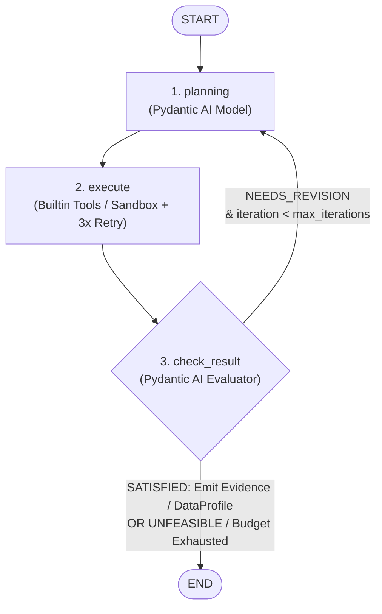

# Data Explorer (DE) MVP Architecture & Design Document

**Location:** `src/cognieda/agents/data_explorer/DE_design.md`  
**Status:** Official Design Specification (MVP) — Aligned with Implementation  
**Frameworks:** LangGraph + Pydantic AI  
**Target Invariant:** Validity preservation, dataset immutability, bounded execution, and direct `Evidence` / `DataProfile` emission.

---

## 1. Overview & System Role

In CogniEDA, the **Data Explorer (DE)** is the specialist agent with exclusive access to datasets. In this MVP version, DE operates as a self-contained, stateful workflow using **LangGraph** for cycle/state management and **Pydantic AI** for structured planning and evaluation.

### Key MVP Responsibilities:
1. Receive data requests from callers (**Planner** for `DATA` tasks, or **Hypothesis Analyst** for `EvidenceRequest`s) via `DEInput`.
2. Deconstruct and iteratively plan analytical tasks using authoritative schema and column profiles from `DataProfile`.
3. Execute operations via deterministic builtin tools or sandboxed Python/Pandas code generation.
4. Provide step-level validation and retries (up to 3 retries per step).
5. Self-evaluate task completeness in a feedback loop (`check_result -> planning`).
6. Directly emit admitted domain objects upon success:
   - **`Evidence`** (for analytical queries / evidence requests)
   - **`DataProfile`** (for dataset profiling requests)
7. Return strongly typed application-facing `DataExplorerOutput`.

---

## 2. LangGraph 3-Node Workflow Architecture

The Data Explorer execution graph consists of exactly three core nodes with a conditional feedback loop:



### Graph Transitions:
- `START -> planning`
- `planning -> execute`
- `execute -> check_result`
- `check_result -> planning` (conditional: when verdict is `needs_revision` and iteration budget remains).
- `check_result -> END` (conditional: when verdict is `satisfied`, `unfeasible`, or error/budget exhausted).

---

## 3. Data Explorer State & Context Schemas

### 3.1 `State` (`types.py`)
```python
class State(BaseModel):
    """Transient state threaded across the three DE graph nodes."""
    model_config = ConfigDict(extra="forbid", arbitrary_types_allowed=True)

    # Input context
    task_id: UUID
    objective_id: UUID | None = None
    task_instruction: str = Field(min_length=1)
    dataset_path: str = Field(min_length=1)
    dataset_digest: str = Field(min_length=1)
    data_profile: DataProfile | None = None  # None for profiling tasks

    # Workflow state
    plan: list[AnalysisStep] = Field(default_factory=list)
    execution_results: list[StepResult] = Field(default_factory=list)
    revision_feedback: str | None = None
    iteration: int = 0
    max_iterations: int = 3

    # Output objects (set on success by check_result)
    emitted_evidence: Evidence | None = None
    emitted_data_profile: DataProfile | None = None

    # Terminal status
    workflow_status: Literal["pending", "succeeded", "failed", "blocked"] = "pending"
    failure_reason: str | None = None
```

### 3.2 `DEInput` & `Context` (`context.py`)
```python
class DEInput(BaseModel):
    """Read-only dataset context injected into the DE workflow at invocation time."""
    model_config = ConfigDict(extra="forbid", frozen=True)

    task_instruction: str
    dataset_path: str
    dataset_digest: str
    data_profile: DataProfile | None = None


class Context(BaseModel):
    """LangGraph context carrying DE model handle and the immutable DE input."""
    model_config = ConfigDict(arbitrary_types_allowed=True, extra="forbid")

    de_model: object  # DataExplorerModel protocol
    de_input: DEInput
```

### 3.3 Step & Result Models (`types.py`)
```python
class ExecutionType(StrEnum):
    BUILTIN_TOOL = "builtin_tool"
    CODE_GENERATION = "code_generation"


class StepStatus(StrEnum):
    PENDING = "pending"
    SUCCEEDED = "succeeded"
    FAILED = "failed"


class AnalysisStep(BaseModel):
    """One bounded step in the DE planning output."""
    step_id: str = Field(min_length=1)
    description: str = Field(min_length=1)
    target_columns: list[str] = Field(default_factory=list)
    execution_type: ExecutionType
    builtin_tool_name: str | None = None
    generated_code: str | None = None
    expected_output_type: str = Field(min_length=1)


class StepResult(BaseModel):
    """Observed output for one executed step, including provenance material."""
    step_id: str = Field(min_length=1)
    status: StepStatus
    output_payload: dict[str, Any] = Field(default_factory=dict)
    variables_accessed: list[str] = Field(default_factory=list)
    values_observed: dict[str, Any] = Field(default_factory=dict)
    error: str | None = None
    retry_count: int = 0
```

---

## 4. Detailed Node Specifications

### 4.1 Node 1: `planning`
- **Objective**: Translate `task_instruction` into a structured sequence of bounded `AnalysisStep`s, referencing only valid columns from `data_profile`.
- **Behavior**:
  - Assembles prompt combining `task_instruction`, `dataset_path`, `data_profile`, prior `revision_feedback`, and already-succeeded steps.
  - Calls `model.plan(prompt)` which invokes Pydantic AI agent loaded with `instruction/planning.txt` and base `instruction/agents.md`.
  - Populates `state.plan` with `list[AnalysisStep]`.

### 4.2 Node 2: `execute`
- **Objective**: Sequentially execute pending steps in `state.plan` using either built-in tools or the Python Sandbox.
- **Execution Paths**:
  1. **`BUILTIN_TOOL`**: Dispatches to deterministic tool function matching `step.builtin_tool_name`.
  2. **`CODE_GENERATION`**: Dispatches `step.generated_code` to the Python sandbox environment.
- **Per-Step Format Validation & Retry Loop**:
  - Retries up to `_MAX_STEP_RETRIES = 3` if execution raises an exception or format error.
  - On success: Records `StepResult(status=SUCCEEDED, output_payload=payload, variables_accessed=...)`.
  - On retry exhaustion: Records `StepResult(status=FAILED, error=error_msg, retry_count=retry_count)`. Execution continues with remaining steps without aborting the graph.

### 4.3 Node 3: `check_result`
- **Objective**: Evaluate whether the accumulated step outputs satisfy the caller's request.
- **Behavior**:
  - Assembles prompt with `task_instruction` and JSON-serialized `state.execution_results`.
  - Calls `model.evaluate(prompt)` which invokes Pydantic AI agent loaded with `instruction/evaluate.txt`.
  - Evaluates `evaluation.verdict`:
    - **`SATISFIED`**:
      - For analytical tasks: constructs and admits immutable `Evidence` object with `EvidenceProvenance`.
      - For profiling tasks: handles `DataProfile` emission.
      - Sets `workflow_status = "succeeded"`.
      - Exits to `END`.
    - **`UNFEASIBLE`**:
      - Sets `workflow_status = "blocked"` and `failure_reason`.
      - Exits to `END`.
    - **`NEEDS_REVISION`**:
      - Increments `state.iteration += 1`.
      - If `state.iteration >= state.max_iterations`: Sets `workflow_status = "failed"` (`MAX_ITERATIONS_EXCEEDED`) and exits to `END`.
      - Else: Sets `state.revision_feedback` and routes back to `planning`.

---

## 5. Pydantic AI Model Layer (`model.py`)

DE uses `DataExplorerModel` which wraps Pydantic AI's `Agent` behind the `DataExplorerDecisionModel` protocol:

```python
class DataExplorerDecisionModel(Protocol):
    async def plan(self, prompt: str) -> PlanningOutput: ...
    async def evaluate(self, prompt: str) -> EvaluationOutput: ...
```

- System instructions are dynamically assembled using `cognieda.agents.utilities.instruction.assemble`:
  - Base identity: `instruction/agents.md`
  - Planning instruction: `instruction/planning.txt`
  - Evaluation instruction: `instruction/evaluate.txt`
- Structured output validation ensures that the LLM always emits typed `PlanningOutput` and `EvaluationOutput` instances.

---

## 6. Direct Domain Object Emission

### 6.1 Direct `Evidence` Construction
When `check_result` evaluates `verdict == SATISFIED` on an analysis task:
```python
Evidence(
    task_id=state.task_id,
    data_profile_id=state.data_profile.data_profile_id,
    content=accumulated_payload,
    provenance=EvidenceProvenance(
        producer_role="data_explorer",
        work_reference=f"de:{uuid4()}",
        dataset_reference=state.dataset_path,
        data_profile_id=state.data_profile.data_profile_id,
        tool_reference="cognieda.data_explorer.langgraph_agent:v1",
    ),
    artifact_refs=(),
)
```

---

## 7. Application Entry Point (`agent.py`)

The main entry point class is `DataExplorer`:

```python
class DataExplorer:
    def __init__(
        self,
        *,
        de_model: DataExplorerDecisionModel | None = None,
        agent_factory: AgentFactoryPort | None = None,
        model_config: ModelConfig | None = None,
        agent_instruction: str = "",
        max_iterations: int = 3,
    ) -> None: ...

    async def run(
        self,
        task_id: UUID,
        de_input: DEInput,
        *,
        objective_id: UUID | None = None,
    ) -> DataExplorerOutput: ...
```

Returns `DataExplorerOutput`:
```python
class DataExplorerOutput(BaseModel):
    task_id: UUID
    evidence: Evidence | None = None
    data_profile: DataProfile | None = None
    summary: str
    error: DEControlledError | None = None
```

---

## 8. Directory & File Layout

```text
src/cognieda/agents/data_explorer/
├── DE_design.md            # This design specification
├── __init__.py             # Public exports (DataExplorer, DEInput, DataExplorerOutput, DEControlledError, DEErrorCode)
├── agent.py                # Main DataExplorer entry point
├── context.py              # Injected LangGraph Context & read-only DEInput
├── graph.py                # LangGraph StateGraph definition and conditional edge
├── model.py                # Pydantic AI adapter (DataExplorerModel, DataExplorerDecisionModel)
├── nodes.py                # 3 core graph nodes: planning, execute, check_result
├── types.py                # State, AnalysisStep, StepResult, PlanningOutput, EvaluationOutput, DataExplorerOutput
├── instruction/
│   ├── agents.md           # Base agent identity instruction
│   ├── planning.txt        # Planning prompt instruction
│   └── evaluate.txt        # Evaluation prompt instruction
└── tools/                  # Deterministic tools & sandbox runners (next phase)
    ├── analyze_dataset.py
    └── profile_dataset.py
```
